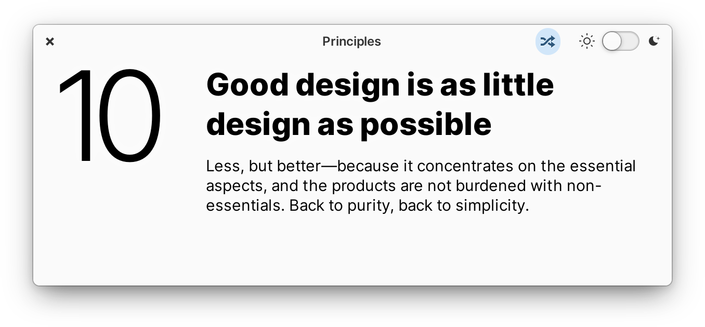
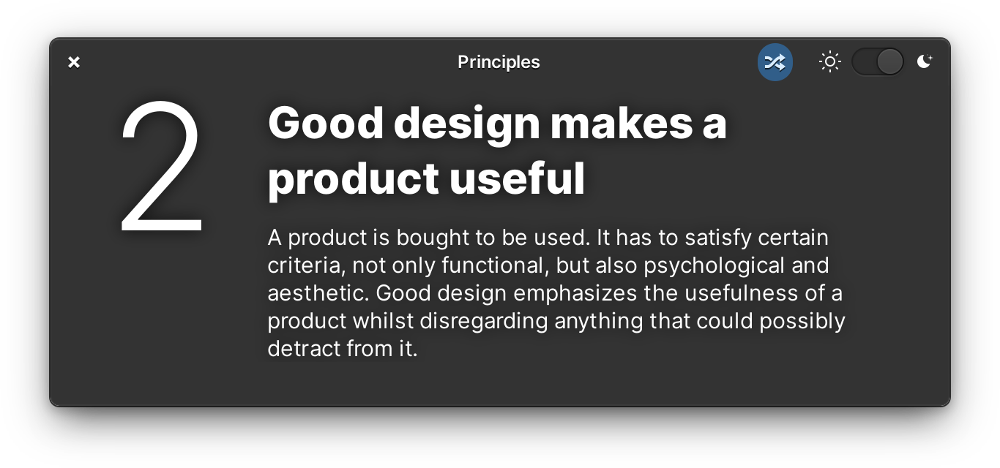

  

<h1 align="center">Principles</h1>

  

|            |            |
| -------------------------------------------- | ------------------------------------------------- |
|  |  |

## Remember Dieter Rams' ten principles of good design

According to Rams, good design:

1. **is innovative** – The possibilities for progression are not, by any means, exhausted. Technological development is always offering new opportunities for original designs. But imaginative design always develops in tandem with improving technology, and can never be an end in itself.

2. **makes a product useful** – A product is bought to be used. It has to satisfy not only functional, but also psychological and aesthetic criteria. Good design emphasizes the usefulness of a product whilst disregarding anything that could detract from it.

3. **is aesthetic** – The aesthetic quality of a product is integral to its usefulness because products are used every day and have an effect on people and their well-being. Only well-executed objects can be beautiful.

4. **makes a product understandable** – It clarifies the product’s structure. Better still, it can make the product clearly express its function by making use of the user's intuition. At best, it is self-explanatory.

5. **is unobtrusive** – Products fulfilling a purpose are like tools. They are neither decorative objects nor works of art. Their design should therefore be both neutral and restrained, to leave room for the user's self-expression.

6. **is honest** – It does not make a product appear more innovative, powerful or valuable than it really is. It does not attempt to manipulate the consumer with promises that cannot be kept.

7. **is long-lasting** – It avoids being fashionable and therefore never appears antiquated. Unlike fashionable design, it lasts many years – even in today's throwaway society.

8. **is thorough down to the last detail** – Nothing must be arbitrary or left to chance. Care and accuracy in the design process show respect towards the consumer.

9. **is environmentally friendly** – Design makes an important contribution to the preservation of the environment. It conserves resources and minimizes physical and visual pollution throughout the lifecycle of the product.

10. **is as little design as possible** – Less, but better – because it concentrates on the essential aspects, and the products are not burdened with non-essentials. Back to purity, back to simplicity.

Get a simple reminder of one of these principles each time you open the app.

## Made for [elementary OS](https://elementary.io)

Principles is designed and developed on and for [elementary OS](https://elementary.io). Purchasing through AppCenter directly supports the development and ensures instant updates straight from me. Get it on AppCenter for the best experience.

Versions of Principles may have been built and made available elsewhere by third-parties. These builds may have modifications or changes and **are not provided nor supported by me**. The only supported version is distributed via AppCenter on elementary OS.

## Developing and Building

If you want to hack on and build Principles yourself, you'll need the following dependencies:

* libgtk-3-dev
* meson
* valac
* libgranite-dev

Run `meson build` to configure the build environment and run `ninja test` to build and run automated tests

    meson build --prefix=/usr
    cd build
    ninja test

To install, use `ninja install`, then execute with `com.github.cassidyjames.principles`

    sudo ninja install
    com.github.cassidyjames.principles

## Other Platforms

Principles is made for elementary OS, but may have been built and made available elsewhere by community members. These builds may have modifications or changes and **are not provided or supported by me**.

## Special Thanks

- [Micah Ilbery](https://github.com/micahilbery) for the shiny icons
- [Daniel Foré](https://github.com/danrabbit) for his apps to use as code examples

-----

